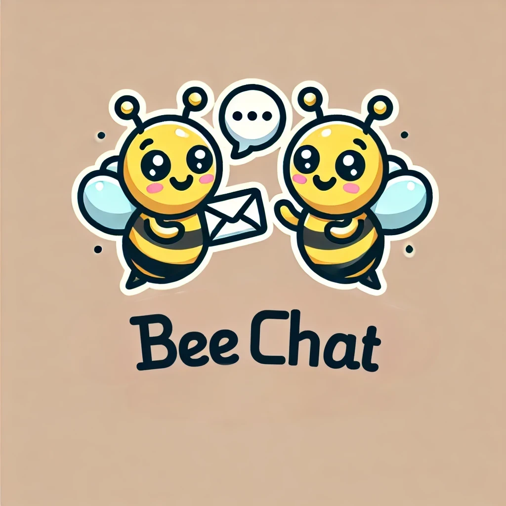

  

# BeeChat

Ok, BeeMail 2.0 was a runaway success. Our user numbers are off the charts. And
our AWS bill is.. well, let's not talk about it. We raised more venture capital
though! So we're going to add a new feature: instant messaging. We're calling it
**BeeChat**.

## User Interface

Our front-end engineers have put together the UI, which you can see in the
`client` folder.

To run the front-end, make sure you have the Live Server extension installed in
VS Code, then right-click on `index.html` and select _Open with Live Server_.

**Note**: the front-end expects a web-socket server to be running on port
`5001`.

## WebSockets

We're using WebSockets to put the "instant" in instant messaging. That's where
you come in. We need you to work in the `server` directory and create a
WebSocket server. We're looking to develop this in two stages.

### Stage 1: Global messaging

If a user sends a message without specifying an ID, the message should be sent
to **every connected client**. This will really bring the community together!

### Stage 2: Targeted messaging

If, however, the user sends a message to a particular ID, then the message
should only be sent to the recipient. This is a bit trickier to get working, but
it's something our competitors do so we're gonna have to keep up!
